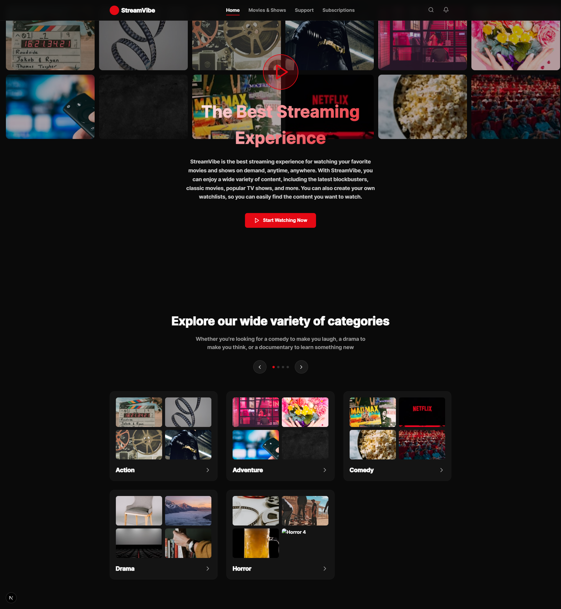

# Экзамен Frontend Разработчик - Screenshoter+

## Описание

Вам предстоит доработать landing page для приложения Screenshoter+. Проект содержит намеренные ошибки и недоработки, которые необходимо исправить.
Изображение макет как он должен выглядеть лежит в папке `public/example.png`


## Время выполнения: 2 часа

## Начало работы

1. Склонируйте репозиторий
2. Переключитесь на свою ветку: `task-[ваш_номер]`

## Критерии оценивания и задания

### 1. Работа с Git (20 баллов)

**Что нужно сделать:**

- Корректно склонировать репозиторий
- Переключиться на нужную ветку
- После выполнения каждого критерия делать коммит с осмысленным сообщением
- Итого должно быть минимум 6 коммитов

**Формат коммитов:**

- `fix: описание того что исправили`
- `feat: описание того что добавили`

### 2. HTML структура и семантика (15 баллов)

**Проблемы в коде:**

- Используются `div` вместо семантических тегов
- Отсутствует навигационное меню в HTML
- Неправильная структура заголовков
- Вставьте пропущенные изображения из папки `public/img`

**Что нужно исправить:**

- Исправить ошибки с семантикой
- Добавить навигационное меню между логотипом и селектором языка
- Добавить выделение цветом для части заголовка "in One Click"

### 3. Верстка и Layout (20 баллов)

**Проблемы в коде:**

- Header не закреплен вверху страницы
- Неправильный фон hero секции
- Сломана сетка features

### 4. Адаптивность (15 баллов)

**Что нужно исправить:**

- Проверить корректное отображение на разных разрешениях (320px, 768px, 1024px, 1440px)
- Исправить ошибки там где это необходимо

### 5. Бизнес логика React (20 баллов)

**Что нужно добавить:**

- Состояние для отслеживания кликов по кнопке "Download for Free"
- Счетчик кликов, который отображается в кнопке после первого клика
- Переключение языка через select (RU/EN)
- Изменение текста в зависимости от выбранного языка

**Пример с данными для перевода:**

```js
const translations = {
  en: {
    title: "Capture and Record Your Screen in One Click",
    description: "With Screenshoter+, you can easily take screenshots...",
    downloadBtn: "Download for Free",
  },
  ru: {
    title: "Захватывайте и записывайте экран в один клик",
    description: "С помощью Screenshoter+ вы можете легко делать скриншоты...",
    downloadBtn: "Скачать бесплатно",
  },
};
```

### 6. Архитектура и компонентизация (10 баллов)

**Что нужно сделать:**

- Разбить монолитный компонент на логические части
- Создать отдельные файлы для каждого компонента
- Правильно организовать передачу props между компонентами
- Изолировать стили для каждого компонента

## Дополнительные требования

- Код должен быть читаемым и содержать комментарии где необходимо
- Использовать современные возможности React (хуки)
- Следовать принципам чистого кода
- Все функции должны работать корректно

Удачи! 🚀
